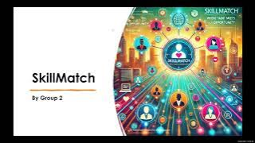

# PRS-PM-2024-10-31-GRP2-JobRecommendationSystem
## Section1 [CHi Tianjun]Data Processing
### 1.1 user data process 
* `user_data_process.ipynb`: clean and select relevant data from original user dataset and generate new dataset
* `job_data_process.ipynb`: clean job dataset, generate job-user interactions, train.txt, item_list, entity_list for model training use
* `entity_list.txt`: consists of user ids, job ids and job attribute values
* `item_list.txt`: consists of job ids and mapped id
* `train.txt`: training set (of user-job interactions, each row: the jobs related to one user)
* `test.txt`: testing set
* `relation.txt`: relationship list to construct knowledge graph

Dataset:https://drive.google.com/drive/folders/1cq1xRHbMgu-eXbBJS3-L9SbCTnPjGWoA?usp=drive_link
## Section2 [Shi Diwei]Resume Information Extraction
### 2.1 pdf/word Resume to picture
### 2.2 OCR recognizes text in pictures
### 2.3 Text processing, extract keywords
## Section3 [Liu Zimu]Recommendation System
### 3.1 KGAT Implementation
#### 3.1.1 Model Input
* `kg_final.txt`: the final knowledge graph
* `test.txt`: the test data
* `train.txt`: the training data
#### 3.1.2 Model Output
* `cf_scores.npy`: Recommendation for each item by each user
### 3.2 New User Recommendation
* `job_clean.csv`: the cleaned job data
* `user_clean.csv`: the cleaned user data
* `new_user.ipynb`: process user data into onehot or list and recommend jobs
## Section4 [Feng Yuan]Web Development
### 4.1 Web app
* `src/main`: directory for webapp written in Java

## Section5 Videos

[Watch Video1](https://www.youtube.com/watch?v=bCVQiMfwemU)

